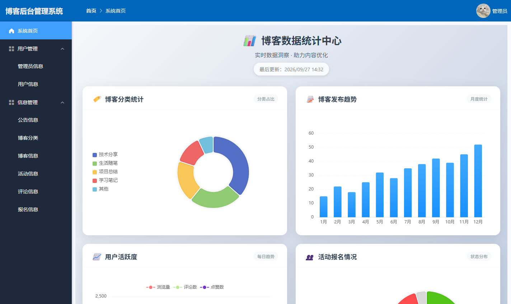

# 博客论坛系统（Blog Forum）

基于 **Spring Boot + Vue2** 的前后端分离博客与活动社交平台，支持 **PC 端与移动端**双端访问。


## 演示账号

| 角色 | 账号 | 密码 |
| --- | --- | --- |
| 管理员 | `admin` | `123456` |
| 普通用户 | `light` | `123456` |

> `blog-xs.sql` 中的种子密码为明文，账号**首次登录时系统会自动将其升级为 BCrypt 密文**（详见「安全设计」一节）。

---

## 一、功能概览

### 前台（PC / 移动端）

- 注册、登录（图形验证码）、修改密码
- 首页：分类筛选、博客榜单、热门活动、公告、关键词搜索
- 博客详情：富文本展示与代码高亮、评论与回复、点赞、收藏、相关推荐
- 博客发布：WangEditor 富文本编辑、封面上传、分类与标签
- 活动：活动列表与详情、报名与取消报名
- 个人中心：资料维护、我发表的博客、我报名的活动、我的点赞 / 收藏 / 评论

### 后台管理

- 数据看板：博客分类占比、发布趋势、用户活跃度、活动报名情况（ECharts）
- 用户管理、管理员管理
- 内容管理：博客、分类、评论、活动、活动报名、公告

## 二、技术栈

| 层次 | 技术选型 |
| --- | --- |
| 后端 | Java 17、Spring Boot 2.5.9、MyBatis-Plus 3.5.3.1、PageHelper 1.4.6、java-jwt 4.3.0、Hutool |
| 数据库 | MySQL 8.0（10 张业务表、80 个 RESTful 接口） |
| 前端 | Vue 2.6.14、Vue Router 3.5.1（hash 模式）、Element UI 2.15.14、Vant 2.13.9（移动端）、Axios 1.5.1、ECharts 6.0、WangEditor 4.7、highlight.js |
| 部署 | Nginx 1.30（静态资源托管 + 反向代理）、Maven 3.9、Node 22 |
| 安全 | JWT 无状态认证、BCrypt 密码哈希、自定义 `@RequireRole` 注解实现服务端 RBAC |

## 三、快速开始

### 1. 环境要求

JDK 17 / Maven 3.9+ / Node 22 / MySQL 8.0 / Nginx 1.30+（部署环节可选）

### 2. 初始化数据库

```bash
# 1) 建库：先进 MySQL 客户端执行（库名含连字符，需用反引号包裹）
mysql -uroot -p
mysql> CREATE DATABASE `blog-xs` DEFAULT CHARACTER SET utf8mb4 COLLATE utf8mb4_unicode_ci;
mysql> exit

# 2) 导入表结构与种子数据
mysql -uroot -p blog-xs < blog-xs.sql
```

> 命令行不便时，也可用 Navicat / MySQL Workbench 等图形工具创建 `blog-xs` 库后导入 `blog-xs.sql`。

### 3. 配置并启动后端

数据库账号密码与 JWT 密钥**不写入版本库**，通过 `application-local.yml`（已加入 .gitignore）或环境变量注入：

```bash
cd springboot/src/main/resources
cp application-local.yml.example application-local.yml
# 编辑 application-local.yml，填入本地数据库账号密码
```

```bash
cd springboot
mvn spring-boot:run
# 或：mvn -DskipTests package && java -jar target/springboot-0.0.1-SNAPSHOT.jar
```

后端服务端口 `9090`。

### 4. 启动前端（开发模式）

```bash
cd vue
npm install
npm run serve      # 访问 http://localhost:8080，接口默认指向 http://localhost:9090（见 .env.development）
```

### 5. 生产部署（Nginx）

```bash
deploy\deploy.bat          # 构建前端并发布静态产物到 D:/deploy/blog-front
# 将 deploy/nginx.conf 覆盖到 nginx/conf/nginx.conf
nginx.exe -t && nginx.exe
# 访问 http://localhost/
```

部署后前后端**同源**：`/api/*` 反向代理至后端 9090，`/files/*` 代理上传文件访问，浏览器跨域限制由此消除。前端接口前缀由 `vue/.env.production` 的 `VUE_APP_BASEURL` 控制（生产值为 `/api`）。

## 四、项目结构

```
├── springboot/                        后端工程（Maven）
│   └── src/main/
│       ├── java/com/example/
│       │   ├── common/                通用层：Result、Constants、自定义注解、JWT 拦截器、枚举
│       │   ├── controller/            接口层（12 个 Controller / 80 个接口）
│       │   ├── service/               业务层
│       │   ├── mapper/                MyBatis Mapper 接口
│       │   ├── entity/                实体类
│       │   ├── exception/             自定义异常与全局异常处理
│       │   └── utils/                 TokenUtils、PasswordUtils
│       └── resources/
│           ├── application.yml        主配置（凭据走环境变量 / 本地配置）
│           └── mapper/*.xml           MyBatis SQL 映射
├── vue/                               前端工程
│   └── src/
│       ├── views/front/               前台页面
│       ├── views/manager/             后台管理页面
│       ├── views/mobile/              移动端页面
│       ├── components/                公共组件（博客/活动列表、评论、分页等）
│       ├── router/                    路由（按设备类型分流 PC / 移动端路由表）
│       └── utils/                     Axios 封装与工具函数
├── deploy/                            Nginx 配置与一键部署脚本
├── admin/                             改造方案与验证记录（含实测数据）
├── docs/screenshots/                  README 截图
└── blog-xs.sql                        数据库结构与种子数据
```

## 五、安全设计

项目在开发过程中围绕「权限、密码、文件」三条链路做过专项加固，每一轮均配套方案文档与实测记录：

| 主题 | 做法 |
| --- | --- |
| 服务端 RBAC | 新增 `@RequireRole` 注解，`JwtInterceptor` 基于 `HandlerMethod` 校验角色（方法级优先、类级兜底）；权限判断由前端 localStorage 迁移到服务端，前后端共用接口改用**资源归属校验**而非角色拦截 |
| 密码存储 | 统一 BCrypt 加盐哈希；存量明文密码在账号首次登录时自动升级为密文 |
| 响应脱敏 | `password` / `newPassword` 字段使用 `@JsonProperty(WRITE_ONLY)`（请求可写入、响应不返回），列表查询的 `Base_Column_List` 不再包含密码列 |
| 令牌安全 | JWT 使用服务端独立密钥（`jwt.secret`），不再以用户密码作为签名密钥 |
| 文件接口 | 按请求方法区分鉴权：GET 放行（`` 无法携带令牌），上传与删除需登录态；上传做后缀白名单校验、服务端重新生成文件名，并校验路径参数防止目录穿越 |



## 六、数据库设计

| 表名 | 说明 |
| --- | --- |
| `user` | 用户（含角色标识、头像、联系方式等） |
| `admin` | 管理员 |
| `blog` | 博客（标题、富文本内容、封面、标签、浏览量） |
| `category` | 博客分类 |
| `comment` | 评论（`pid` / `root_id` 支撑树形回复） |
| `likes` | 点赞（`fid` + `module` 同时支撑博客与活动） |
| `collect` | 收藏（同上，与点赞同构） |
| `activity` | 活动（时间、地点、形式、主办方、封面） |
| `activity_sign` | 活动报名记录 |
| `notice` | 系统公告 |

## 七、相关文档

`admin/` 目录下按时间记录了项目改造的完整过程（问题定位 → 方案 → 实施 → 实测）：

| 文档 | 内容 |
| --- | --- |
| `后台鉴权RBAC升级方案_2026-09-27.md` | 越权问题定位、两类接口的差异化收权策略、38 项接口验证 |
| `密码加密与文件鉴权加固_2026-09-27.md` | BCrypt 与存量惰性升级、响应脱敏、文件接口鉴权与上传校验 |
| `Nginx部署方案与验证记录_2026-09-27.md` | 部署架构、静态托管与反向代理配置、11 项端到端验证 |
| `端到端验收记录_2026-09-27.md` | 无头浏览器真点击验收：PC 端 24 项、移动端 9 项结果 |

## 八、License

[MIT](LICENSE)
